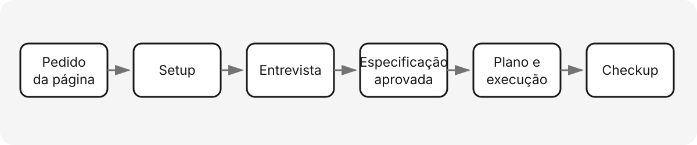
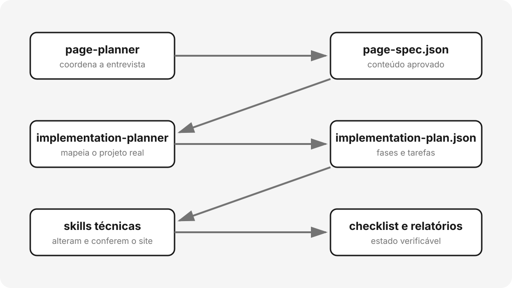

# Visão geral

O Astrofy organiza a criação e a evolução de sites Astro em quatro fases:

1. `astrofy-setup` lê o projeto, reconhece seus recursos e prepara o estado de
   trabalho em `.astrofy/`.
2. `astrofy-page-planner` identifica o tipo de página e encaminha a conversa
   para uma especialista.
3. `astrofy-implementation-planner` relaciona o conteúdo aprovado com rotas,
   componentes, integrações, testes e documentação do projeto real.
4. As skills técnicas implementam e conferem cada parte do plano.

O Astrofy não exige um formulário completo no primeiro contato. A pessoa pode
começar com uma frase, como “quero uma página para meu produto”. A
orquestradora confirma o tipo, coleta o conteúdo por etapas e apresenta três
alternativas quando uma escolha editorial depende do usuário.

## Artefatos do projeto

| Caminho | Conteúdo |
| --- | --- |
| `.astrofy/config/project.json` | Configuração reconhecida pelo setup |
| `.astrofy/pages/<slug>/page-spec.json` | Especificação estruturada da página |
| `.astrofy/pages/<slug>/brief.md` | Leitura humana do conteúdo aprovado |
| `.astrofy/plans/<slug>/implementation-plan.json` | Fases e tarefas |
| `.astrofy/plans/<slug>/implementation-plan.md` | Plano técnico para revisão |
| `.astrofy/checklist.json` | Estado das verificações do site |

## Classificação

| Campo | Valor |
| --- | --- |
| Natureza | Normativo |
| Escopo | Fluxo e artefatos públicos do Astrofy |
| Autoridade | Orquestradoras, schemas e CLI |
